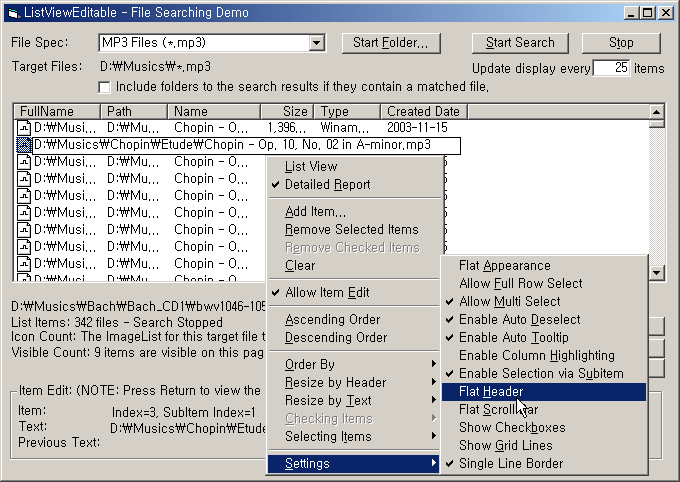



## ListViewEditable Control with File Searching \(Edit ListView Subitems\)

### Description

ListViewEditable control allows editing subitems of list view items. It also provides a file searching function. In addition, the property pages provoded allow you to customize various properties such as column headers to suit your needs. I tried to make it useful as possible as I can. I extend thanks to many coders on this site or others because their codes and ideas helped me finish this project.
 
### More Info
 

             |
---                |---
**Submitted On**   |2004-05-19 13:01:22
**By**             |[S\.Y\. Kim](https://github.com/Planet-Source-Code/PSCIndex/blob/master/ByAuthor/s-y-kim.md)
**Level**          |Intermediate
**User Rating**    |5.0 (25 globes from 5 users)
**Compatibility**  |VB 6\.0
**Category**       |[Custom Controls/ Forms/  Menus](https://github.com/Planet-Source-Code/PSCIndex/blob/master/ByCategory/custom-controls-forms-menus__1-4.md)
**World**          |[Visual Basic](https://github.com/Planet-Source-Code/PSCIndex/blob/master/ByWorld/visual-basic.md)
**Archive File**   |[ListViewEd1747365192004\.zip](https://github.com/Planet-Source-Code/s-y-kim-listvieweditable-control-with-file-searching-edit-listview-subitems__1-53881/archive/master.zip)

